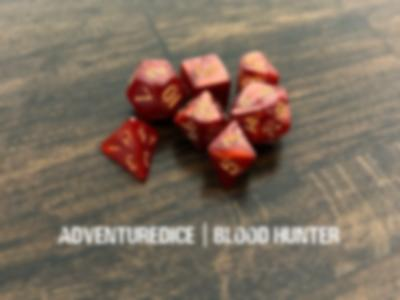

# Additional Info and examples

## Transform Configuration

Each transform can be independently enabled with a customizable probability value.

## Dataset Generation Methodology

### 1. Standardization

All images, and their annotations, are resized to the selected resolution.

### 2. Generation Multiplier

Selectable number of additional images to be made (0-500%, can be set to more in [transformer.py](transformer.py)) with transform selection to create more diverse training samples.

### 3. Dataset Splitting

Automated train/validation/test splitting, ensuring proper data distribution across splits.

### 4. Quality Control

• Test mode generation for visual verification of all transform effects

## Notes

### Transform Pipeline

Transforms are applied sequentially with early termination on failure. The pipeline prioritizes multi image transforms before single image transforms.

<!-- 'Horizontal Flip':
'Vertical Flip': {'
'Random Rotate': {'
'HSV': {'enabled':
'Random Brightness'
'Random Contrast':
'Gaussian Blur': {'
'Random Affine': {'
'Noise': {'enabled'
'CutOut': {'enabled -->

## Examples

### Original

  

### Horizontal flip

  

### Vertical flip

  

### Random rotate

  

### HSV

  

### Random brightness

  

### Random Contrast

  

### Gaussian Blur

  

### Random Affine

  

### Noise

  

### CutOut

  

### Mixup

  

### Mosaic

  

